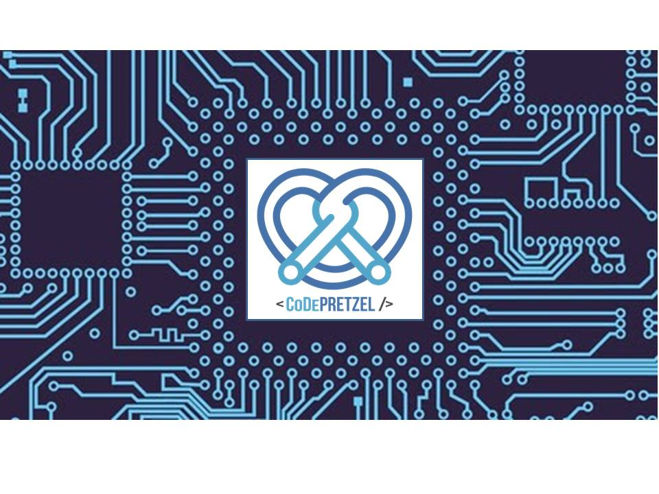

## Comunidad de Desarrolladores Pretzel es un colectivo con los objetivos de.

Hola, bienvenidos.
Aquí les vamos a aclarar la duda, acerca de qué es CoDe Pretzel.

**Misión**: Fomentar el desarrollo económico de la región abriendo el mercado de sistemas embebidos, enlazando a jóvenes emprendedores con empresarios que puedan necesitar su talento para crear proyectos a la medida que ayuden a resolver sus áreas de oportunidad beneficiando así el emprendimiento local.  

**Visión**: Ser una comunidad formada por ingenieros interesados en acercar la ciencia y la tecnología a la sociedad, unidos en apoyo a la educación, la cultura, el emprendimiento y la modernización nuestra sociedad. 

**Objetivos**: Ser una organización que impulse el desarrollo económico de la región apoyando a emprendedores y empresas mediante proyectos a la medida en el mercado de sistemas embebidos, incentivando el interés a emprender proyectos de este mercado mediante pláticas, conferencias y eventos sociales impactando desde jóvenes  estudiantes hasta empresarios.

